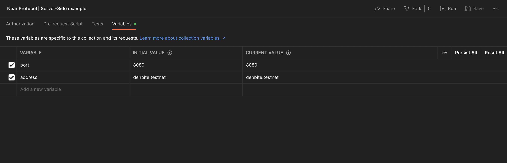
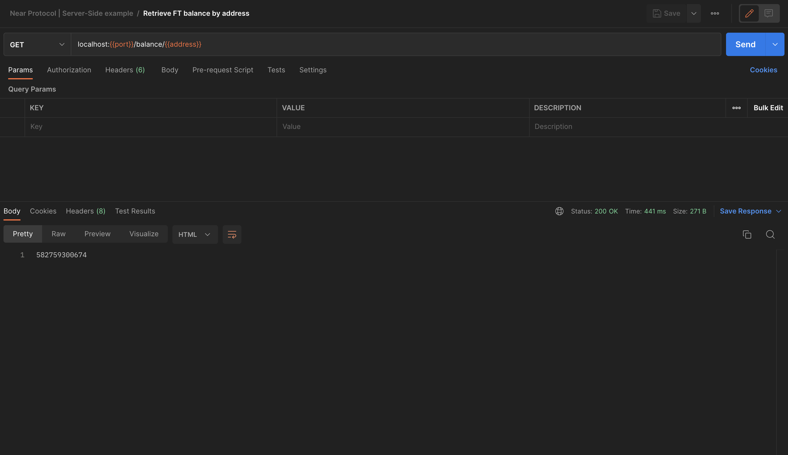
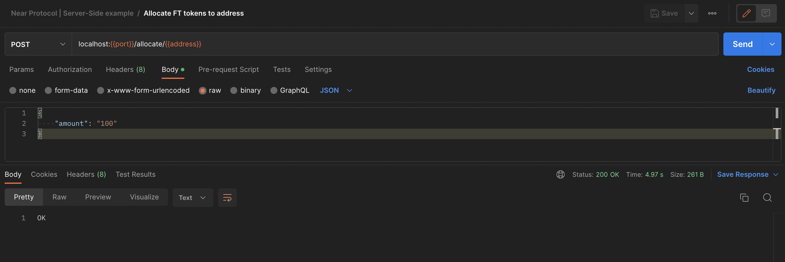

<!-- PROJECT LOGO -->
<br />
<div align="center">
  <h2 align="center">Near Protocol | Server-Side</h2>

  <p align="center">
    A working example of NodeJS server-side integration with Near Protocol smart-contract
    <br />
    <br />
    <a href="https://github.com/nearuaguild"> Explore other examples</a>
    ·
    <a href="https://github.com/nearuaguild/near-server-side/issues">Report Bug</a>
  </p>
</div>

## Developed by


**Near Ukrainians Guild** is a fast-growing guild aimed at providing high-quality educational content and assistance to grow a strong community of Ukrainian developers/entrepreneurs in the Near Protocol ecosystem

[![Twitter][twitter]][twitter-url]
[![Youtube][youtube]][youtube-url]
[![Telegram Chat][telegram-chat]][telegram-chat-url]
[![Telegram Channel][telegram-channel]][telegram-channel-url]
[![Medium][medium]][medium-url]
[![Github][github]][github-url]

---

<!-- ABOUT THE PROJECT -->

## About The Project

This example is basically a Fungible Token faucet API which provides a possibility to distribute tokens among users by their request

Implementing server-side integration for communication with Near Protocol smart-contract has its own pros & cons - you must consider them when planning the use cases of your application

### Pros

- Additional features can be implemented (Authorization, Notifications, Delayed execution, etc)
- End users don't need to have deep knowledge about smart contracts, because they have a way to communicate through well-known REST API

### Cons

- Transactions that change state aren't free and must be paid - you'll pay for them
- Your application has to implement rate limits, so your Near funds wouldn't fire covering millions of unnecessary transactions
- Your smart contract's change methods must be closed from calling directly by the end-user otherwise someone would definitely call it directly avoiding your authorization

### Built With

- [![NodeJS][node.js]][next-url]
- [![Express][express.js]][react-url]
- [near-api-js (v1.1.0)](https://github.com/near/near-api-js)

---

<!-- GETTING STARTED -->

## Getting Started

💡 _Before you begin, make sure you have the following installed_

- [Node.js v16 or above](https://nodejs.org/en/download/)
- [Git](https://git-scm.com/book/en/v2/Getting-Started-Installing-Git/)

### Installation

Follow these simple instructions to set up a local development environment

1. Clone the repo
   ```sh
   git clone https://github.com/nearuaguild/near-server-side.git
   ```
2. Install NPM packages
   ```sh
   yarn install
   ```
3. Copy the example env file to `.env`
   ```sh
   cp .env.dist .env
   ```
4. Enter your Fungible Token contract address & private key in `.env` (variables below are just examples, you must fill them with your own values)

   ```env
    CONTRACT_ID=test_ft_token.denbite.testnet

    PRIVATE_KEY=ed25519:14sZJ64JFLxuocU7xu2DkV2yE7mAGCnfFhjbH10vQePR32JzpcMVK63jSSHgzb29mBzEMv27Sqs87SHsR3PMxhp6
   ```

5. Build server
   ```sh
   yarn build
   ```
6. Launch application
   ```sh
   yarn start
   ```

---

<!-- USAGE EXAMPLES -->

## Usage

We've prepared Postman collection for you to easily communicate with API once it's started

- [Collection Link](https://api.postman.com/collections/6953403-91d24e13-4954-4c7a-9b5d-019178e330f7?access_key=PMAT-01GQ794JVQDC55MG96Y4BNGNY7)
- [How to import Postman collection via link](https://apitransform.com/how-to-import-a-collection-into-postman/)



### Demo

1. Retrieve initial balance for account
   
2. Then request allocation in 100 tokens for this account
   
3. Retrieve balance one more time, and confirm that balance has changed
   

<!-- LICENSE -->

## License

Distributed under the MIT License. See `LICENSE.txt` for more information.

<!-- MARKDOWN LINKS & IMAGES -->
<!-- https://www.markdownguide.org/basic-syntax/#reference-style-links -->

<!-- Built with -->

[node.js]: https://img.shields.io/badge/nodejs-000000?style=for-the-badge&logo=nodedotjs&logoColor=white
[express.js]: https://img.shields.io/badge/express-000000?style=for-the-badge&logo=express&logoColor=white
[node-url]: https://nodejs.org/en/
[express-url]: https://expressjs.com/ru/

<!-- Socials -->

[twitter]: https://img.shields.io/badge/news-1DA1F2?style=for-the-badge&logo=twitter&logoColor=white
[youtube]: https://img.shields.io/badge/broadcasting-282828?style=for-the-badge&logo=youtube&logoColor=ff0000
[medium]: https://img.shields.io/badge/articles-202020?style=for-the-badge&logo=medium&logoColor=ffffff
[telegram-chat]: https://img.shields.io/badge/chat-229ED9?style=for-the-badge&logo=telegram&logoColor=white
[telegram-channel]: https://img.shields.io/badge/channel-229ED9?style=for-the-badge&logo=telegram&logoColor=white
[github]: https://img.shields.io/badge/code-000000?style=for-the-badge&logo=github&logoColor=ffffff
[twitter-url]: https://twitter.com/nearuaguild
[youtube-url]: https://www.youtube.com/@nearprotocolukraineguild4064
[medium-url]: https://medium.com/near-protocol-ua
[telegram-chat-url]: https://t.me/nearprotocolua
[telegram-channel-url]: https://t.me/nearprotocoluachannel
[github-url]: https://github.com/nearuaguild
